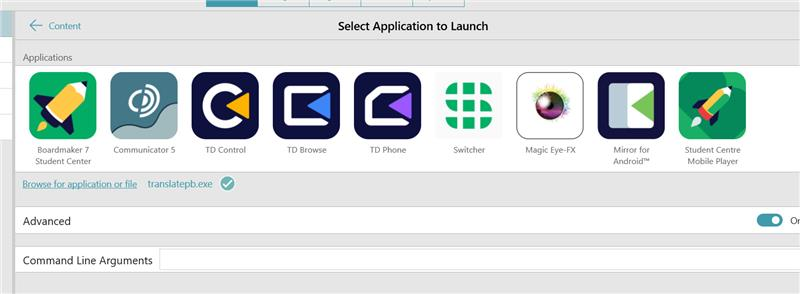
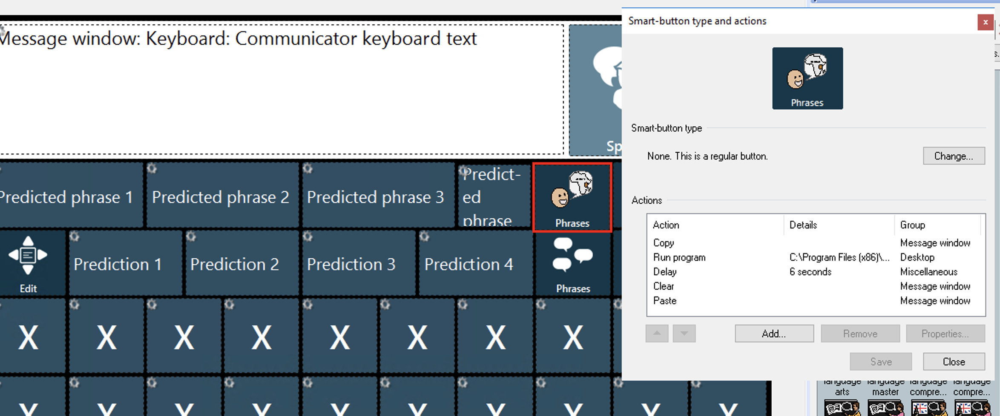

# AAC Online Speak & Translate Plug-in for Windows ("AAC Speak Helper")

## Introduction

AAC Speak Helper is designed to enhance your ability to communicate. It leverages the copy-paste clipboard, offers translation services in various languages, and uses Text-to-Speech (TTS) technology to read aloud the translated text. This tool uses either Google or Azure Cloud TTS to provide a wide range of languages and voices. You can easily configure all these functionalities through our Configure app, and even maintain multiple settings files for different tasks.

## Use Case

Imagine you are a Ukrainian speaker with limited English skills, residing in a care facility. AAC Speak Helper acts as a bridge between you and your caregivers, translating your Ukrainian text into English. Moreover, it also supports people who need to speak in languages that are less commonly supported, by using TTS technology.

## Compatibility

AAC Speak Helper is a lightweight Windows executable. It can be called from any AAC app on Windows that has the capability to run external programs.

## How it Works

Once text is copied to the clipboard (using Ctrl+C), AAC Speak Helper reads that text. Depending on the configuration settings, it either translates the text using the selected service and speaks it aloud or simply reads the text.

## Installation

### Step 1: Download

Download the installer from [our latest release](https://github.com/AceCentre/TranslateAndTTS/releases/latest).

### Step 2: Install

Run the installer. It will place the program in `C:\Program Files (x86)\Ace Centre\TranslateAndTTS\`.

### Step 3: Configure

After installation, navigate to `%AppData%\TranslateAndTTS` in File Explorer to find the `settings.cfg` file. Edit the configuration using either a text editor or the `Configure TranslateAndTTS` app available in the Start Menu.

Note: You can copy this settings file and have numerous versions of them - or make it and distribute to an end user. To run the application using a different config file you would use the ``--config filpath.cfg`` parameter

### Step 4. Add in your support to your AAC software.

See below for specific details but in short;

- Add a button to *copy* the message bar (writing area)
- Then have an action on this button to call the executable found at ``C:\Program Files (x86)\Ace Centre\TranslateAndTTS\translatepb.exe``
- Then its wise to wait around 5-10 seconds
(and if translating text)
- Clear the message bar
- Paste the returning text back if you are translating

You can of course test it out by running the app and having some text copied from a text file. Give it a go. 

## Supported Languages

This tool supports a multitude of languages, provided through Azure and Google Cloud. For a detailed list, please refer to the respective sections below.

### Languages by Azure
- Afrikaans
- Albanian
- Amharic
- Arabic
- Armenian
- Azerbaijani
- Bangla
- Bengali
- Bosnian
- Bulgarian
- Burmese
- Catalan
- Chinese
- Croatian
- Czech
- Danish
- Dutch
- English
- Estonian
- Filipino
- Finnish
- French
- Galician
- Georgian
- German
- Greek
- Gujarati
- Hebrew
- Hindi
- Hungarian
- Icelandic
- Indonesian
- Irish
- Italian
- Japanese
- Javanese
- Kannada
- Kazakh
- Khmer
- Korean
- Lao
- Latvian
- Lithuanian
- Macedonian
- Malay
- Malayalam
- Maltese
- Marathi
- Mongolian
- Nepali
- Norwegian Bokmål
- Pashto
- Persian
- Polish
- Portuguese
- Romanian
- Russian
- Serbian
- Sinhala
- Slovak
- Slovenian
- Somali
- Spanish
- Sundanese
- Swahili
- Swedish
- Tamil
- Telugu
- Thai
- Turkish
- Ukrainian
- Urdu
- Uzbek
- Vietnamese
- Welsh

### Languages by Google Cloud
 - Afrikaans (South Africa)
 - Arabic
 - Basque (Spain)
 - Bengali (India)
 - Bulgarian (Bulgaria)
 - Catalan (Spain)
 - Chinese (Hong Kong)
 - Czech (Czech Republic)
 - Danish (Denmark)
 - Dutch (Belgium)
 - Dutch (Netherlands)
 - English (Australia)
 - English (India)
 - English (UK)
 - English (US)
 - Filipino (Philippines)
 - Finnish (Finland)
 - French (Canada)
 - French (France)
 - Galician (Spain)
 - German (Germany)
 - Greek (Greece)
 - Gujarati (India)
 - Hebrew (Israel)
 - Hindi (India)
 - Hungarian (Hungary)
 - Icelandic (Iceland)
 - Indonesian (Indonesia)
 - Italian (Italy)
 - Japanese (Japan)
 - Kannada (India)
 - Korean (South Korea)
 - Latvian (Latvia)
 - Lithuanian (Lithuania)
 - Malay (Malaysia)
 - Malayalam (India)
 - Mandarin Chinese
 - Marathi (India)

## Getting API Keys for TTS Services

### Azure TTS

- You first need Azure subscription - [Create one for free](https://azure.microsoft.com/free/cognitive-services).
- [Create a Speech resource](https://portal.azure.com/#create/Microsoft.CognitiveServicesSpeechServices) in the Azure portal.
- Your Speech resource key and region. After your Speech resource is deployed, select Go to resource to view and manage keys. For more information about Azure AI services resources, see [Get the keys for your resource](https://learn.microsoft.com/en-us/azure/ai-services/multi-service-resource?pivots=azportal#get-the-keys-for-your-resource)

### Google Cloud TTS

Creating a service account for OAuth 2.0 involves generating credentials for a non-human user, often used in server-to-server interactions. Here's how you can create OAuth 2.0 credentials using a service account for Google APIs:

Go to the Google Cloud Console:
Visit the Google Cloud Console.

Create a New Project:
If you don't have a project already, create a new project in the developer console.

Enable APIs:
Enable the APIs that your service account will be using. For example, if you're using Google Drive API, enable that API for your project.

Create a Service Account:

1. Go to the Google Cloud Console:
Visit the [Google Cloud Console](https://console.cloud.google.com/).

2. Create a New Project:
If you don't have a project already, create a new project in the developer console.

3. Enable APIs:
Enable the APIs that your service account will be using. For example, if you're using Google Drive API, enable that API for your project.

4. Create a Service Account:
- In the Google Cloud Console, navigate to "IAM & Admin" > "Service accounts."
- Click on "Create Service Account."
- Enter a name for the service account and an optional description.
- Choose the role for the service account. This determines the permissions it will have.
- Click "Continue" to proceed.

5. Create and Download Credentials:
- On the next screen, you can choose to grant the service account a role on your project. You can also skip this step and grant roles later.
- Click "Create Key" to create and download the JSON key file. This file contains the credentials for your service account.
- Keep this JSON file secure and do not expose it publicly.

6. Use the Service Account Credentials:
- In your code, load the credentials from the JSON key file. The credentials can be used to authenticate and access the APIs on behalf of the service account.

7. Grant Required Permissions:
- If you skipped assigning roles during the service account creation, you can now grant roles to the service account by navigating to "IAM & Admin" > "IAM" and adding the service account's email address with the appropriate roles.

## Using the style flag for Azure voices

Note: You can use the ``--style`` flag on the command line for Azure voices. If you do this follow it by one of these style flags. 

- advertisement_upbeat
- affectionate
- angry
- assistant
- calm
- chat
- cheerful
- customerservice
- depressed
- disgruntled
- documentary-narration
- embarrassed
- empathetic
- envious
- excited
- fearful
- friendly
- gentle
- hopeful
- lyrical
- narration-professional
- narration-relaxed
- newscast
- newscast-casual
- newscast-formal
- poetry-reading
- sad
- serious
- shouting
- sports_commentary
- sports_commentary_excited
- whispering
- terrified
- unfriendly

## AAC Specific Guides

### Snap

### The Grid 3

See the demo gridset [here](https://github.com/AceCentre/TranslateAndTTS/tree/main/assets)

### Communicator

See the demo pageset [here](https://github.com/AceCentre/TranslateAndTTS/tree/main/assets)

### NuVoice

### MindExpress

Don't bother - MEX already can do this. See [here for a demo](https://www.jabbla.co.uk/vocab/translation-tool/)

## Specific notes on Kurdish TTS

We are using the web system found at http://tts.kurdishspeech.com

- Maximum characters is 2000 characters per entry
- The Web endpoint can deal with latin characters or Arabic. You need to use the setting to allow latin characters if the text is in latin characters. It cant deal with mixed input
- Its typical for Kurdish speakers to use a latin (QWERTY - US English layoout) 
- You can have a Kurdish layout too - or use the language input of your computer to do the conversion

See [here](https://kurdishcentral.org/sorani-keyboard-layout/) for some details on the layout. 

Use [this tool](https://www.lexilogos.com/keyboard/kurdish_conversion.htm) to convert arabic to Latin characters

- You need to have the settings set for latin or not
- It is wise to  cache results. You may ned to set your cache to 0 to clear the cache if there is audio that goes wrong 

## Developer details

See build details [here](https://github.com/AceCentre/TranslateAndTTS/blob/main/.github/workflows/windows-build-release.yml)

## Troubleshooting

As this is a quick prototype, it may have some issues. For issues regarding connectivity or functionality, please note that Azure, Google Cloud and translation services require an online connection. If you have any questions, suggestions, or contributions, feel free to create a pull request or [donate](https://acecentre.org.uk/get-involved/donate).

