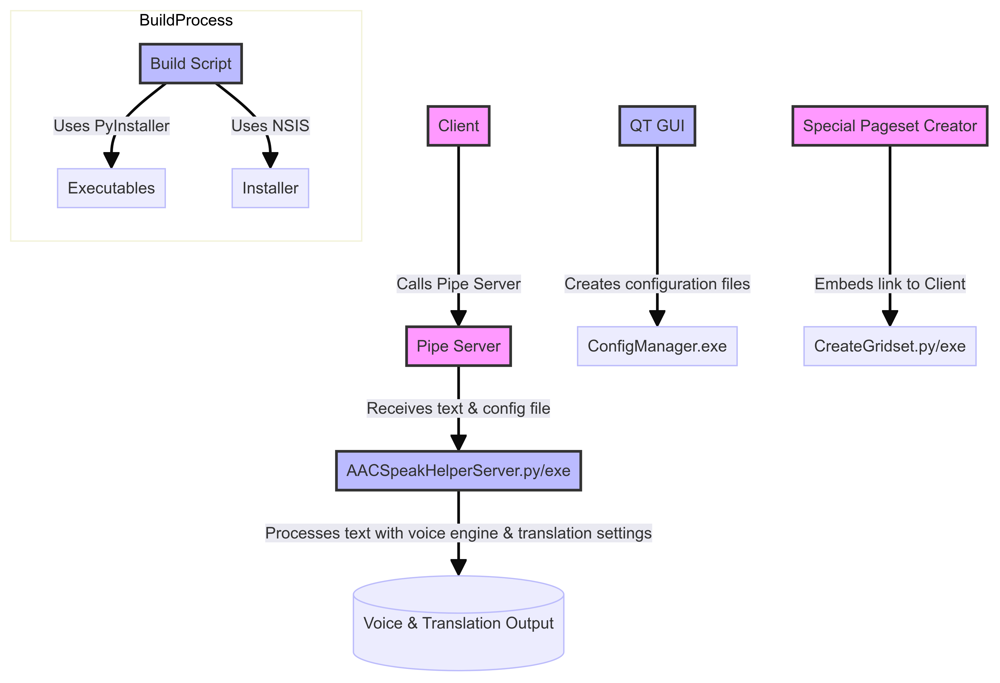

# AAC Online Speak & Translate Plug-in for Windows ("AAC Speak Helper")


## For Full Documentation see here https://docs.acecentre.org.uk/products/v/aac-speak-helper-tool/ 

## Introduction

AAC Speak Helper is designed to enhance your ability to communicate. It leverages the copy-paste clipboard to offer translation services in various languages. It uses multiple providers' Text-to-Speech (TTS) technology to read aloud the translated text. You can easily configure all these functionalities through our Configure app and maintain numerous settings files for different tasks.

## Use Case

Imagine you are a Ukrainian speaker with limited English skills residing in a care facility. AAC Speak Helper bridges you and your caregivers, translating Ukrainian text into English. Moreover, it supports people who need to speak languages less commonly supported by TTS technology.

[](https://www.loom.com/share/dcd185df50224279a0c2630b6ca6b04f)

## Compatibility

AAC Speak Helper is a lightweight Windows executable. It can be called from any AAC app on Windows that can run external programs.

## How it Works

AAC Speak Helper reads the text once the text is copied to the clipboard (using Ctrl+C). Depending on the configuration settings, it either translates the text using the selected service, speaks it aloud, or reads it. There are additional features, such as putting intonation (or style) onto some voices. We have a graphical application that can configure the app. The main application, though, has no interface. 

## Developer details

see [this mermaid graph](https://www.mermaidchart.com/raw/bc383b62-6f3e-47de-b168-90786a151ea5?theme=light&version=v0.1&format=svg)



See build details [here](https://github.com/AceCentre/TranslateAndTTS/blob/main/.github/workflows/windows-build-release.yml). 


## Prerequisites

1. **Install Python 3.11** (or higher) for Windows from the [official Python website](https://www.python.org/downloads/release/python-31011/).

2. **Install Poetry** if you don't have it already. You can install Poetry by running:

    ```sh
    curl -sSL https://install.python-poetry.org | python3 -
    ```

    Alternatively, on Windows, you can use:

    ```sh
    (Invoke-WebRequest -Uri https://install.python-poetry.org -UseBasicParsing).Content | python -
    ```

    Ensure that Poetry is available in your PATH. You can verify this by running:

    ```sh
    poetry --version
    ```

## Setting Up the Development Environment

1. **Clone the Repository** if you haven't already:

    ```sh
    git clone https://github.com/AceCentre/AACSpeakHelper.git
    cd AACSpeakHelper
    ```

2. **Create a Virtual Environment and Install Dependencies**:

    Poetry automatically handles virtual environments, so you don't need to manually create one. Simply run:

    ```sh
    poetry install
    ```

    This command will:
    
    - Create a virtual environment in the `.venv` directory within your project.
    - Install all dependencies listed in `pyproject.toml` and lock them in `poetry.lock`.

3. **Activate the Virtual Environment** (if needed):

    While Poetry typically handles this automatically, you can activate the virtual environment manually if required:

    ```sh
    poetry shell
    ```

## Running the Application

1. **Run the Server**:

    With the virtual environment active, you can run the application directly:

    ```sh
    poetry run python AACSpeakHelperServer.py
    ```

    This ensures that the Python interpreter and dependencies used are from the Poetry-managed environment.
    
    to call the client now you do (in a different terminal/console)


    ```sh
    poetry run python client.py
    ```

    And GUI


    ```sh
    poetry run python GUI_TranslateAndTTS/widget.py
    ```
    
    
## Additional Tips

- **Adding Dependencies**: To add new dependencies, use:

    ```sh
    poetry add <package_name>
    ```

- **Updating Dependencies**: To update all dependencies to their latest versions (within the constraints defined):

    ```sh
    poetry update
    ```

- **Exiting the Virtual Environment**: To exit the Poetry shell (virtual environment), simply type:

    ```sh
    exit
    ```
    


## Troubleshooting

As this is a quick prototype, it may have some issues. For issues regarding connectivity or functionality, please note that Azure, Google Cloud and translation services require an online connection. If you have any questions, suggestions, or contributions, please create a pull request or [donate](https://acecentre.org.uk/get-involved/donate).

