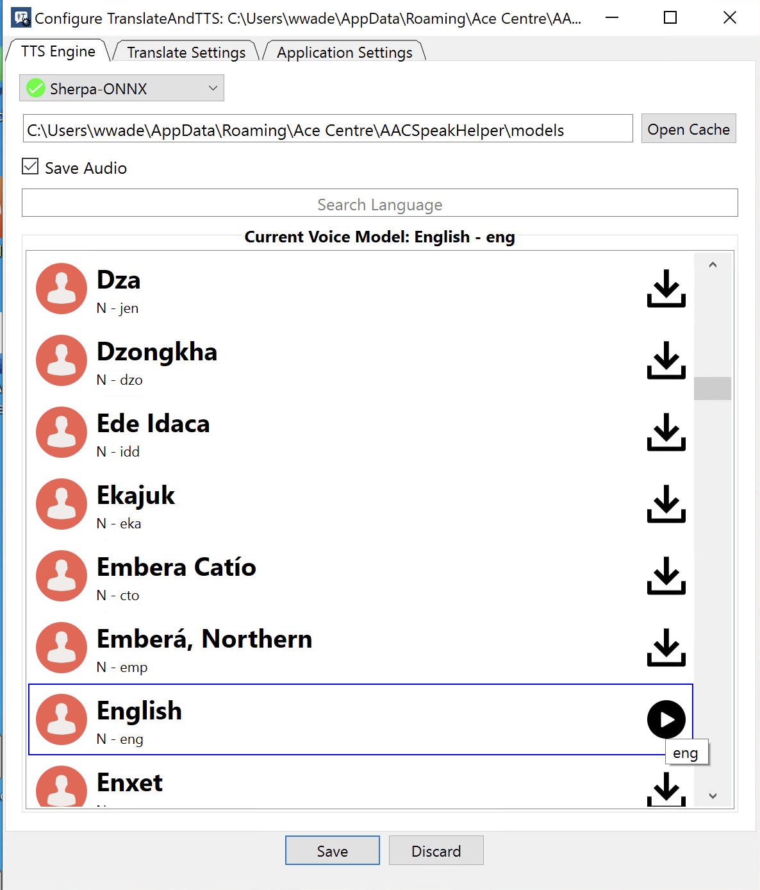
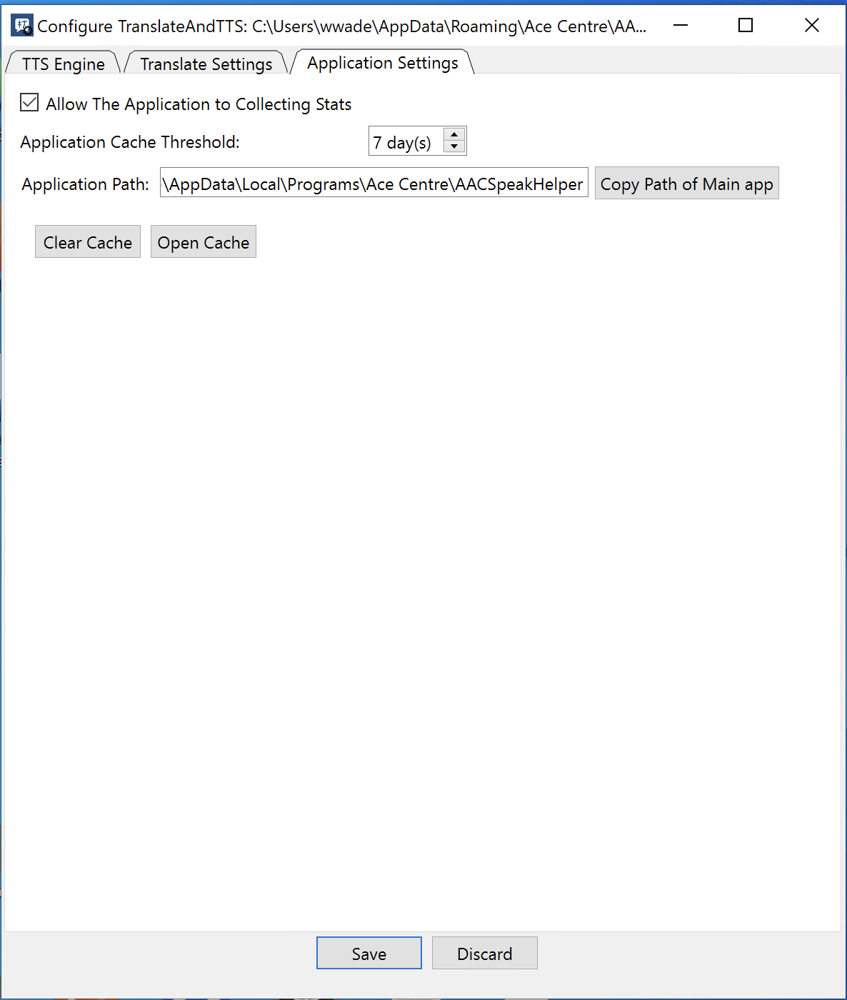

# Configure

After installation, you need to configure the application. You can edit the settings file by hand or use our GUI application **`Configure TranslateAndTTS`**, which you can find in your start menu and Desktop. It looks like this

It has 3 Tab areas

### TTS Engine

#### Drop Down for Engine

This means the "Text to Speech Engine" - voice system. We have several to choose from. The most likely one is sherpa-onnx. Its Offline and supports a large range of languages not supported by other systems. The quality may not be perfect however and it may be too slow for your needs but we find its a good balance.&#x20;


Sherpa-onnx does work offline but you must be online when configuring it as it may need to download the voice model


You can choose the engine in the dropdown. We also have Google, Microsoft Azure or Google Translate. All these options require you to be online all the time.  For Google or Azure you have the option to add your own keys. **We recommend adding your own keys as our keys may stop working.**&#x20;

**Voices List**

**Simply look for your language and voice. You can preview a voice by pressing on the play button.**&#x20;


**On Sherpa-Onnx you need to first download the model and then press Play but note - please wait a little while before hearing anything. Each model is around 250Mb so it can take a while for the model to be setup.**&#x20;

**Also note - the first time it speaks may take a while**

**Most importantly TTS voices **_**typically**_**  will only speak reliably if the correct text is provided to it. Latin text (English) wont work for those that are looking for arabic script**


**Choose a voice by pressing on the voice - you can see what is selected by the text "Current Voice" in the configure screen**

<figure><figcaption></figcaption></figure>

#### **Save Audio**

If you want to cache audio for TTS tick this box. It wills save small wav files for each utterance saving time for further calls.&#x20;

### **Translate Settings**

**Firstly if you DON'T want your system to translate (eg. your client is writing in the correct language for the TTS System) untick the "Translate" box on this page. Otherwise it will assume your writing language and convert it to the Target language**

You can choose your translation provider. Note that "GoogleTranslator" is free and that seen at translate.google.com - if you use this a lot you may find it stop working. Equally some systems are better at other languages.&#x20;

#### **Overwrite pasteboard**

You want this if you want your AAC software to print the translated text

#### **Bypass TTS**

This will mean that TTS isnt done at all and you only want to use our tool for translation

<figure><figcaption></figcaption></figure>

### Application Settings

You generally don't need to edit anything here. We do collect the number of times our app is run and used anonymously. If you want to turn this off do so here. Note too, if you have chosen to save the audio you can choose how long the cache is kept for.&#x20;

<figure><figcaption></figcaption></figure>

### **A note for those more adventurous**&#x20;

You can edit the settings file by hand if you wish. To do this, navigate to `%AppData%\Ace Centre\AACSpeakHelper` in File Explorer to find the `settings.cfg` file. Edit the configuration using either a plain text editor.

**Note: You can copy this settings file and have numerous versions of them - or make it and distribute it to an end user. You would use the `--config file path to run the application using a different config file.cfg` parameter**
