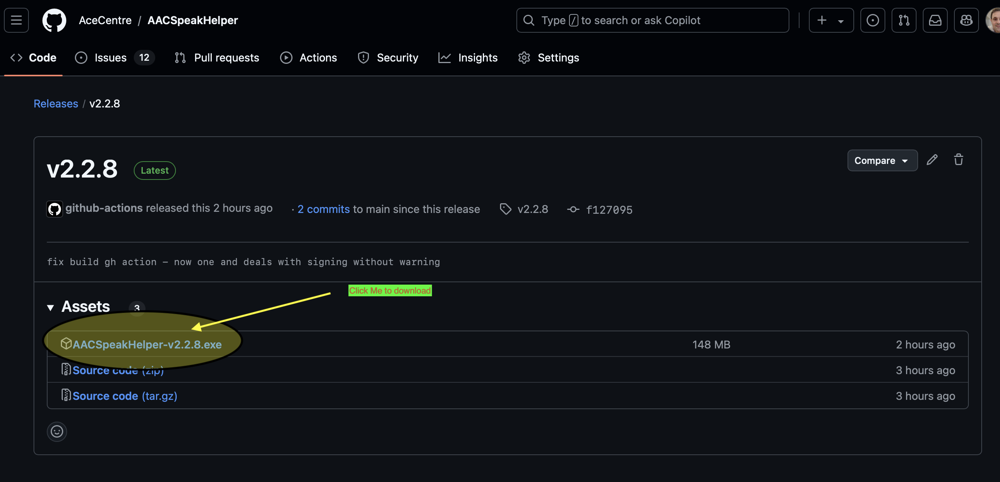

# Download

Download the installer from our [latest release](https://github.com/AceCentre/AACSpeakHelper/releases/tag/vv2.2.1). You click on the link under "assets" for the file named **AACSpeakHelper-v2.2.8.exe (or whatever number is there)** (eg. Right now download this "[AACSpeakHelper-v2.2.8.exe](https://github.com/AceCentre/AACSpeakHelper/releases/download/v2.2.8/AACSpeakHelper-v2.2.8.exe) )

Alternatively you will find the current most release on the Ace Centre Website

<figure><figcaption></figcaption></figure>

