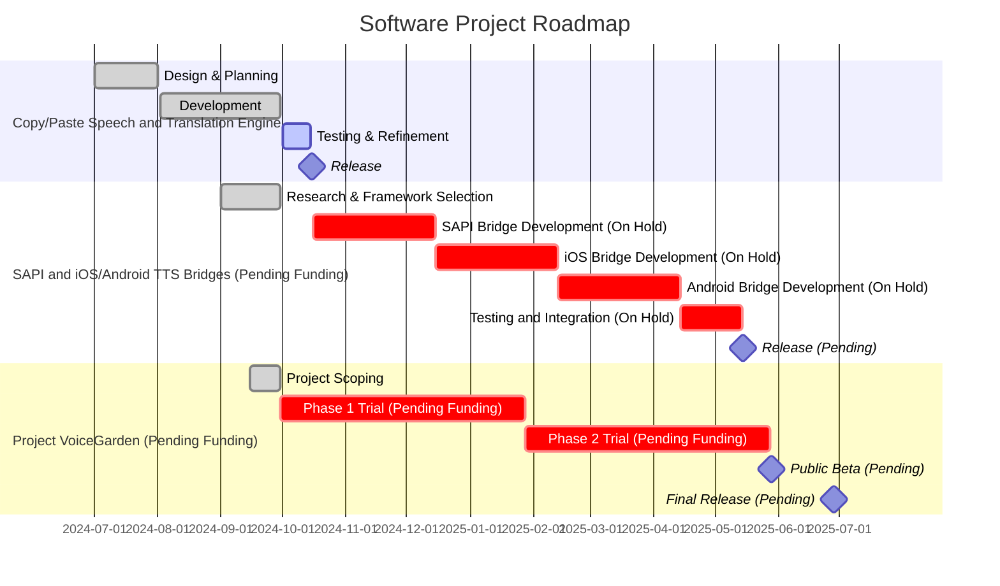

# Troubleshooting and Feature requests

As this is a quick prototype, it may have some issues. For issues regarding connectivity or functionality, please note that Azure, Google Cloud and translation services require an online connection. If you have any questions, suggestions, or contributions, please create a pull request or [donate](https://acecentre.org.uk/get-involved/donate).

## Common Feature requests

* Offline Translation. Although possible with NLLB (Meta) its not easy to do all the language pairs we potentially need.&#x20;
* The key feature is to make the integration easier. This is actually best done if it was a system wide voice rather than all software having to integrate different providers. So how do we do it? See our roadmap&#x20;
* ElevenLabs access.&#x20;
* Offline Azure/Google etc voices. Although advertised as kind of possible its not without limitations (notably not all voices are available like this from Microsoft and particularly not those that are of high need becauser we dont have much language support)

## Roadmap

