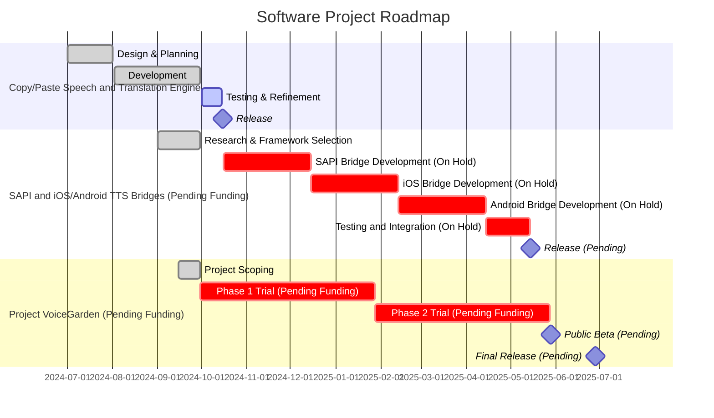

# Roadmap

```mermaid fullWidth="true"
gantt
    title Software Project Roadmap
    dateFormat  YYYY-MM-DD
    section Copy/Paste Speech and Translation Engine
    Design & Planning        :done, des1, 2024-07-01, 2024-08-01
    Development              :done, dev1, 2024-08-02, 2024-09-30
    Testing & Refinement     :active, test1, 2024-10-01, 2024-10-15
    Release                  : milestone, rel1, 2024-10-15, 1d
    
    section SAPI and iOS/Android TTS Bridges (Pending Funding)
    Research & Framework Selection :done, res1, 2024-09-01, 2024-09-30
    SAPI Bridge Development (On Hold)    :crit, dev2, after rel1, 60d
    iOS Bridge Development (On Hold)     :crit, dev3, after dev2, 60d
    Android Bridge Development (On Hold) :crit, dev4, after dev3, 60d
    Testing and Integration (On Hold)    :crit, test2, after dev4, 30d
    Release (Pending)                    : milestone, rel2, after test2, 1d
    
    section Project VoiceGarden (Pending Funding)
    Project Scoping            : done, proj1, 2024-09-15, 2024-09-30
    Phase 1 Trial (Pending Funding)      :crit, dev5, after proj1, 120d
    Phase 2 Trial (Pending Funding)      :crit, coll1, after dev5, 120d
    Public Beta (Pending)                : milestone, beta1, after coll1, 1d
    Final Release (Pending)              : milestone, rel3, after beta1, 60d
```
